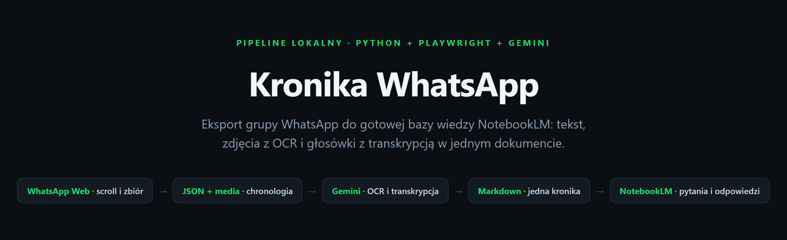
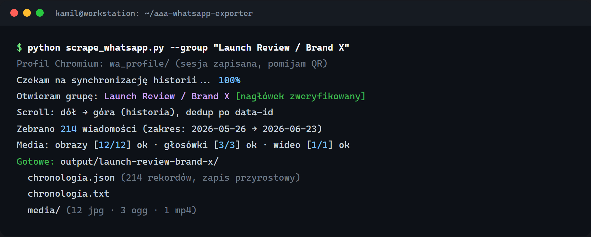
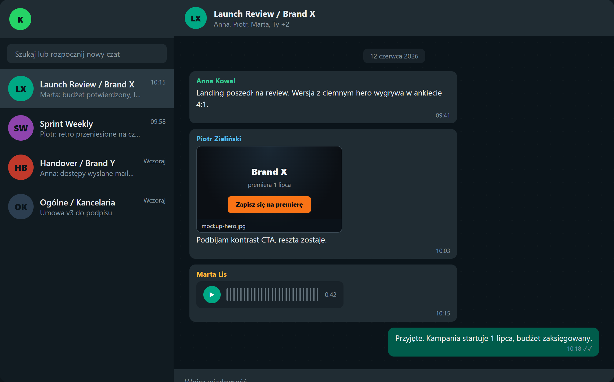
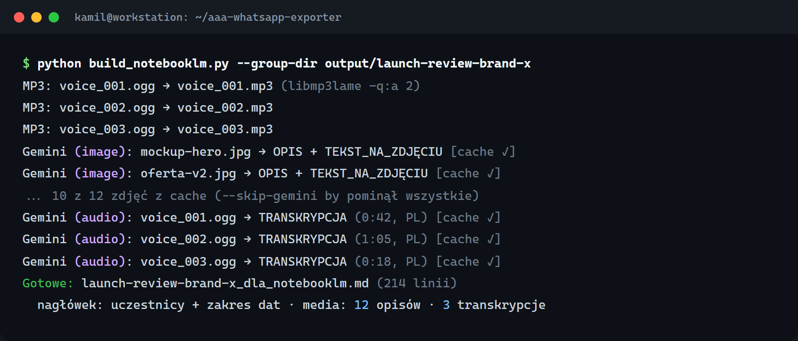
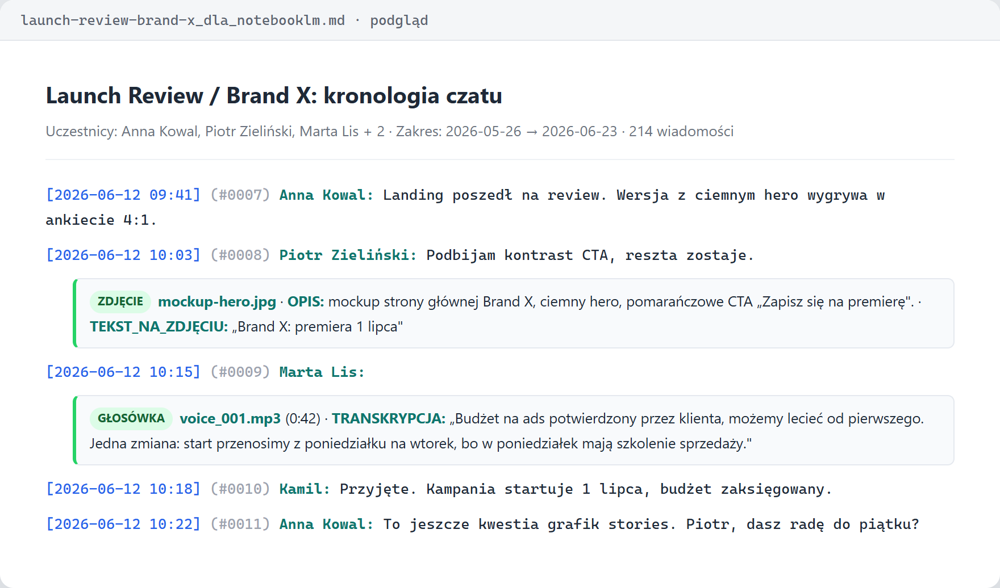
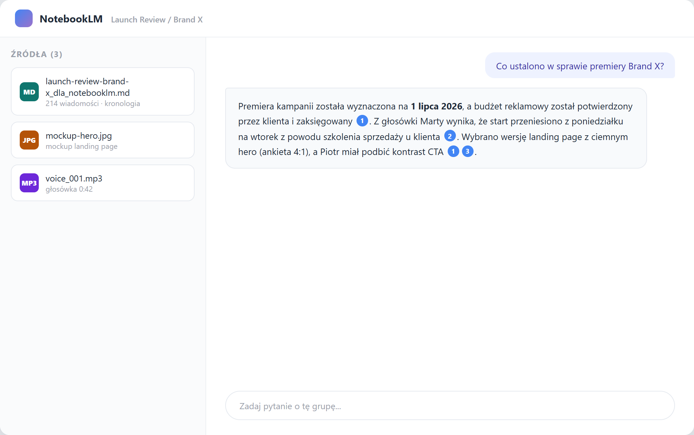
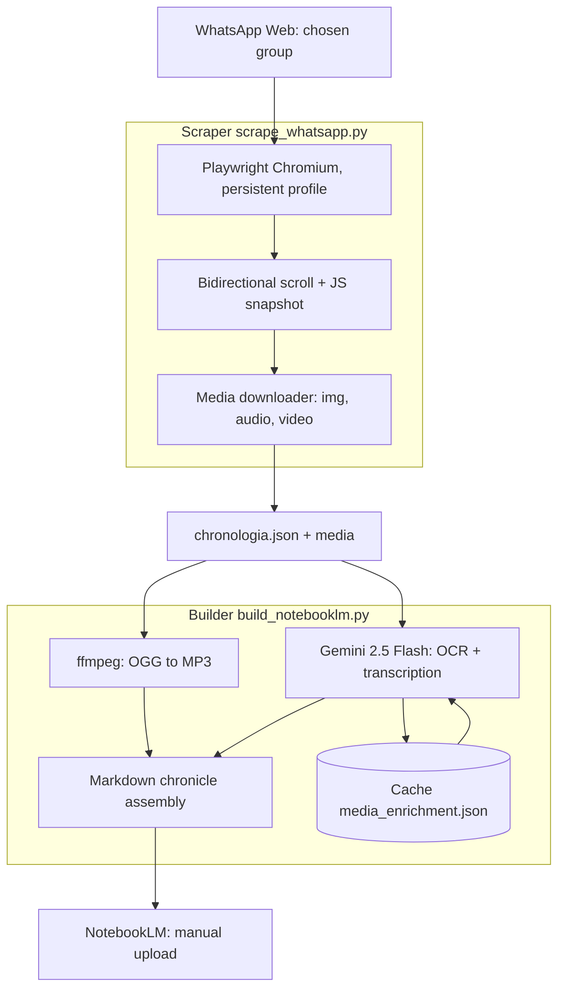

<p align="center"><a href="README.md">Polski</a> | <b>English</b></p>

<p align="center"></p>
<h1 align="center">WhatsApp Chronicle</h1>
<h3 align="center">Turns a WhatsApp group into a searchable knowledge base with image OCR and voice-message transcription</h3>

<p align="center">
  
  
  
  
  
</p>

## Table of contents

- [About](#about)
- [Screenshots](#screenshots)
- [Source code](#source-code)
- [Stack](#stack)
- [Features](#features)
- [Architecture](#architecture)
- [Statistics](#statistics)
- [Contact](#contact)

---

## About

Client projects live in WhatsApp groups: decisions, mockups, voice messages with approvals. A few weeks in, nobody remembers what was agreed, and the in-app search can't read images or audio. NotebookLM answers questions about documents, but there is no way to feed it a chat: WhatsApp's export drops media, voice messages come in a format NotebookLM rejects, and an image without a description is invisible to the model.

Two scripts close the path. The first logs into WhatsApp Web, opens the chosen group and collects the conversation history in both directions, saving every message without duplicates. It downloads media separately: images, voice messages and video. Saving is incremental, so an interruption mid-run doesn't lose what was already exported. The second script describes images and transcribes audio via Gemini, converts voice files to a format NotebookLM accepts and assembles a single Markdown file with participants, dates and numbered lines.

The pipeline has completed 4 real exports of project groups: 339 messages in total, spanning May 26 to June 23, 2026. The largest group: 165 messages with 8 images and 3 voice messages. The result goes into NotebookLM via manual upload (MD + images + MP3), and from that point you simply ask the chat questions.

---

## Screenshots

| Terminal: project group export | WhatsApp Web while collecting history |
|:---:|:---:|
|  |  |

| Terminal: image descriptions and audio transcription | Markdown document: full chronicle with media |
|:---:|:---:|
|  |  |

| NotebookLM: sources and an answer about project decisions |
|:---:|
|  |

> **Note:** the frames show a fictional test group (mocks with synthetic data), not real chats from the exports. The real groups are client projects and don't appear in public materials.

---

## Source code

The code is private. This repo is a project showcase: description, architecture and screenshots. The tool uses WhatsApp Web outside Meta's official API, so it is for your own internal groups, not for exporting other people's chats.

---

## Stack

```
Scraper (CLI)
Python 3.x                         // 1067 LOC
Playwright (Chromium)              // persistent profile, WhatsApp Web session
JS snapshot in page.evaluate       // message collection, data-id dedup

Builder (CLI)
Python 3.x                         // 344 LOC
google-genai (Gemini 2.5 Flash)    // Files API: image OCR, audio transcription
ffmpeg                             // OGG/OPUS → MP3 (libmp3lame -q:a 2)
python-dotenv                      // API key from .env

Target
Google NotebookLM                  // manual upload: MD + images + MP3
```

---

## Features

### WhatsApp Web scraper

- **Saved browser session** - QR scan only once, then login without repeating
- **Wait for full history** - up to 30 minutes with a progress bar; on timeout it continues with what was collected
- **Open a group several ways** - exact title, search box or list scrolling; verification before collecting
- **Collect messages from the page** - one read of the conversation panel with message-ID deduplication
- **Scroll in both directions** - WhatsApp shows only a slice of the list: newest first, then older messages upward
- **Polish and English dates** - D.M.Y and M/D/Y formats, plus Today/Yesterday
- **Download media by type** - images, voice messages and video saved separately with incremental JSON
- **No-media or media-only modes** - fetch missing files without re-scrolling

### NotebookLM builder

- **Gemini 2.5 Flash** - file upload, wait until ready, then generate descriptions
- **Image OCR** - scene description and visible text on the image, in Polish
- **Voice-message transcription** - unintelligible fragments marked on noise
- **Audio conversion to MP3** - so NotebookLM accepts the files; skipped when the MP3 is newer
- **On-disk cache** - resume interrupted processing without calling the API again
- **Upload-ready Markdown** - header with participants and date range, lines with timestamps and sender
- **Unread messages** - explicit marker instead of guessing content

---

## Architecture



---

## Statistics

### Technical complexity

| Metric | Value |
|---|---|
| **Pipeline** | 2 CLI scripts, 1411 LOC of Python |
| **Scraper** | 1067 LOC |
| **Builder** | 344 LOC |
| **Diagnostics** | 4 debug scripts, 183 LOC |
| **Total** | 1594 LOC of Python |
| **Dependencies** | playwright, google-genai, python-dotenv + system ffmpeg |

### Usage (as of Sep 8, 2026)

| Metric | Value |
|---|---|
| **Group exports** | 4 real project groups |
| **Total messages** | 339 |
| **Largest group** | 165 messages (8 images, 3 voice messages) |
| **Date range** | 2026-05-26 → 2026-06-23 |
| **Media types** | images (OCR), voice messages (transcription), video (placeholder) |

> Numbers from scripted counting on disk (`wc`, parsing `chronologia.json`), not from memory. Local project, no git history.

---

## Contact

| Platform | Link |
|---|---|
| **WWW** | [kamilkaczmareksolutions.com](https://kamilkaczmareksolutions.com) |
| **GitHub** | [kamilkaczmareksolutions](https://github.com/kamilkaczmareksolutions) |
| **LinkedIn** | [Kamil Kaczmarek](https://www.linkedin.com/in/kamilkaczmareksolutions) |
| **Email** | [recruitment@kamilkaczmareksolutions.com](mailto:recruitment@kamilkaczmareksolutions.com) |

---

**WhatsApp Chronicle** - from a project group chat straight to a knowledge base you can query.

<p align="center"><em>Built by Kamil Kaczmarek</em></p>
