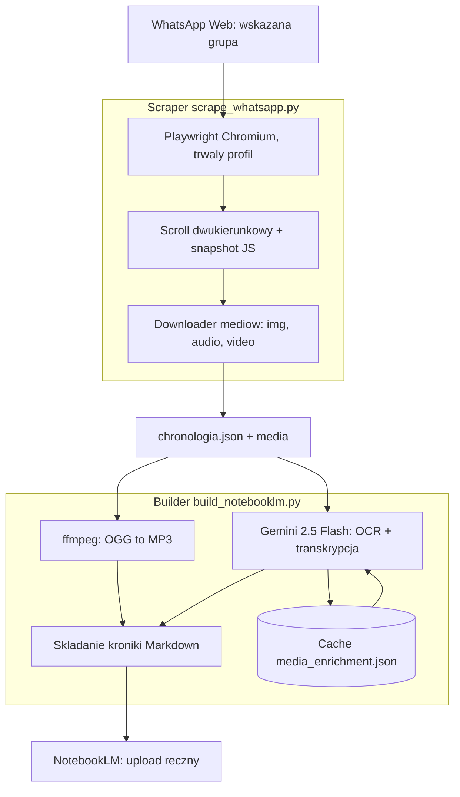

<p align="center"><b>Polski</b> | <a href="README.en.md">English</a></p>

https://github.com/user-attachments/assets/3b42e11b-7e80-4e2c-bcae-ba8ca5f54f3b

<!-- Poprzednie hero (backup, statyczne): assets/hero.png -->
<h1 align="center">Kronika WhatsApp</h1>
<h3 align="center">Z grupy WhatsApp robi przeszukiwalną bazę wiedzy z OCR zdjęć i transkrypcją głosówek</h3>

<p align="center">
  
  
  
  
  
</p>

## Spis treści

- [O projekcie](#o-projekcie)
- [Screenshoty](#screenshoty)
- [Kod źródłowy](#kod-źródłowy)
- [Stack](#stack)
- [Funkcje](#funkcje)
- [Architektura](#architektura)
- [Statystyki](#statystyki)
- [Kontakt](#kontakt)

---

## O projekcie

Projekty klienckie żyją w grupach WhatsApp: ustalenia, mockupy, głosówki z decyzjami. Po kilku tygodniach nikt nie pamięta, co ustalono, a szukajka w aplikacji nie czyta zdjęć ani audio. NotebookLM odpowiada na pytania o dokumenty, ale czatu się do niego nie wrzuci: eksport WhatsApp gubi media, głosówki są w formacie, którego NotebookLM nie przyjmuje, a zdjęcie bez opisu jest dla modelu niewidzialne.

Dwa skrypty domykają ścieżkę. Pierwszy loguje się do WhatsApp Web, otwiera wskazaną grupę i zbiera historię rozmowy w obie strony, zapisując każdą wiadomość bez duplikatów. Pobiera też media osobno: zdjęcia, głosówki i wideo. Zapis jest przyrostowy, więc przerwanie w połowie nie gubi dotychczasowego eksportu. Drugi skrypt opisuje zdjęcia i transkrybuje audio przez Gemini, konwertuje pliki głosowe do formatu akceptowanego przez NotebookLM i składa jeden Markdown z uczestnikami, datami i numerowanymi liniami.

Pipeline przeszedł 4 realne eksporty grup projektowych: 339 wiadomości łącznie, zakres od 26 maja do 23 czerwca 2026. Największa grupa: 165 wiadomości z 8 zdjęciami i 3 głosówkami. Wynik ląduje w NotebookLM ręcznym uploadem (MD + zdjęcia + MP3) i od tego momentu o czat można po prostu pytać.

---

## Screenshoty

| Terminal: eksport grupy projektowej | WhatsApp Web podczas zbierania historii |
|:---:|:---:|
|  |  |

| Terminal: opisy zdjęć i transkrypcja audio | Dokument Markdown: pełna kronika z mediami |
|:---:|:---:|
|  |  |

| NotebookLM: źródła i odpowiedź na pytanie o ustalenia |
|:---:|
|  |

> **Nota:** kadry pokazują fikcyjną grupę testową (mocki na sztucznych danych), nie prawdziwe czaty z eksportów. Prawdziwe grupy to projekty klienckie i nie wchodzą do materiałów publicznych.

---

## Kod źródłowy

Kod jest prywatny. To repo to wizytówka projektu: opis, architektura i screenshoty. Narzędzie korzysta z WhatsApp Web poza oficjalnym API Meta, więc służy do własnych grup wewnętrznych, nie do eksportu cudzych czatów.

---

## Stack

```
Scraper (CLI)
Python 3.x                         // 1067 LOC
Playwright (Chromium)              // trwały profil, sesja WhatsApp Web
Snapshot JS w page.evaluate        // zbiór wiadomości, dedup po data-id

Builder (CLI)
Python 3.x                         // 344 LOC
google-genai (Gemini 2.5 Flash)    // Files API: OCR zdjęć, transkrypcja audio
ffmpeg                             // OGG/OPUS → MP3 (libmp3lame -q:a 2)
python-dotenv                      // klucz API z .env

Cel
Google NotebookLM                  // upload ręczny: MD + zdjęcia + MP3
```

---

## Funkcje

### Scraper WhatsApp Web

- **Zapisana sesja przeglądarki** - skan QR tylko raz, potem logowanie bez powtarzania
- **Czekanie na pełną historię** - do 30 minut z paskiem postępu; po timeoutcie kontynuuje na zebranym materiale
- **Otwieranie grupy na kilka sposobów** - dokładny tytuł, wyszukiwarka lub przewijanie listy; weryfikacja przed zbiorem
- **Zbieranie wiadomości ze strony** - jednorazowy odczyt panelu rozmowy z deduplikacją identyfikatorów wiadomości
- **Przewijanie w obie strony** - WhatsApp pokazuje tylko fragment listy: najpierw najnowsze, potem starsze wiadomości w górę
- **Daty po polsku i angielsku** - rozpoznawanie formatów D.M.Y i M/D/Y, plus Dzisiaj/Wczoraj
- **Pobieranie mediów wg typu** - zdjęcia, głosówki i wideo zapisują się osobno z przyrostowym JSON
- **Tryby bez mediów lub tylko media** - dociągnięcie brakujących plików bez ponownego przewijania

### Builder pod NotebookLM

- **Gemini 2.5 Flash** - upload plików, czekanie na gotowość, potem generowanie opisów
- **OCR zdjęć** - opis sceny i tekst widoczny na obrazie, po polsku
- **Transkrypcja głosówek** - z oznaczeniem niezrozumiałych fragmentów przy szumie
- **Konwersja audio do MP3** - żeby NotebookLM przyjął pliki; pomija, gdy MP3 jest aktualniejszy
- **Cache na dysku** - wznawianie przerwanej obróbki bez ponownego wołania API
- **Markdown gotowy do uploadu** - nagłówek z uczestnikami i zakresem dat, linie z timestampami i nadawcą
- **Wiadomości nieodczytane** - jawne oznaczenie zamiast zgadywania treści

---

## Architektura



---

## Statystyki

### Złożoność techniczna

| Metryka | Wartość |
|---|---|
| **Pipeline** | 2 skrypty CLI, 1411 LOC Python |
| **Scraper** | 1067 LOC |
| **Builder** | 344 LOC |
| **Diagnostyka** | 4 skrypty debug, 183 LOC |
| **Razem** | 1594 LOC Python |
| **Zależności** | playwright, google-genai, python-dotenv + ffmpeg systemowo |

### Użycie (stan na 2026-09-08)

| Metryka | Wartość |
|---|---|
| **Eksporty grup** | 4 realne grupy projektowe |
| **Wiadomości łącznie** | 339 |
| **Największa grupa** | 165 wiadomości (8 zdjęć, 3 głosówki) |
| **Zakres dat** | 2026-05-26 → 2026-06-23 |
| **Typy mediów** | zdjęcia (OCR), głosówki (transkrypcja), wideo (placeholder) |

> Liczby z liczenia skryptowego na dysku (`wc`, parsowanie `chronologia.json`), nie z pamięci. Projekt lokalny, bez historii git.

---

## Kontakt

| Platforma | Link |
|---|---|
| **WWW** | [kamilkaczmareksolutions.com](https://kamilkaczmareksolutions.com) |
| **GitHub** | [kamilkaczmareksolutions](https://github.com/kamilkaczmareksolutions) |
| **LinkedIn** | [Kamil Kaczmarek](https://www.linkedin.com/in/kamilkaczmareksolutions) |
| **Email** | [recruitment@kamilkaczmareksolutions.com](mailto:recruitment@kamilkaczmareksolutions.com) |

---

**Kronika WhatsApp** - z grupy projektowej prosto do bazy wiedzy, o którą można pytać.

<p align="center"><em>Zbudował Kamil Kaczmarek</em></p>
